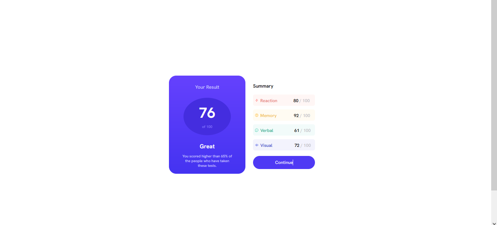

# Frontend Mentor - Results summary component solution

This is a solution to the [Results summary component challenge on Frontend Mentor](https://www.frontendmentor.io/challenges/results-summary-component-CE_K6s0maV). Frontend Mentor challenges help you improve your coding skills by building realistic projects. 

## Table of contents

- [Overview](#overview)
  - [Screenshot](#screenshot)
  - [Links](#links)
- [My process](#my-process)
  - [Built with](#built-with)
  - [What I learned](#what-i-learned)
  - [Continued development](#continued-development)
- [Author](#author)
- [Acknowledgments](#acknowledgments)

## Overview
I decided to complete this challenge after completing Angela Yu's lesson on HTML and CSS Flexbox. Took me over 3 hours to get this done but I faced a bit of a challenge as I'm unable to make users not see the part of the summary section that doesn't have a curved border. I decided to rather make it's background the same as the body background so that users wont see any curved border for that part.

### Screenshot

## My process

### Built with

- Semantic HTML5 markup
- CSS custom properties
- Flexbox

### What I learned

I learned how to successfully use Flexbox and media queries. I will keep on working on this project to make it perfect. This project aside from applying what I learned also taught me to be patient and find solutions to certain hurdles or obstacles i encounted. It took me over 3 hours to complete this.

### Continued development

I will be learning CSS Grid soon and I'll apply that to this project and see how it goes. 

## Author

- Website - [David Boateng](https://linktr.ee/kbthe2)
- Frontend Mentor - [@kbthe2](https://www.frontendmentor.io/profile/kbthe2)
- Twitter - [@kbtheII](https://twitter.com/kbtheII)

## Acknowledgments

Was able to complete this project with the little I learned from Dr. Angela Yu's course on Udemy - The Complete 2023 Web Development Bootcamp

